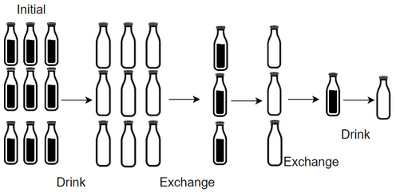

* 1518.There are numBottles water bottles that are initially full of water. You can exchange numExchange empty water 
bottles from the market with one full water bottle.

The operation of drinking a full water bottle turns it into an empty bottle.

Given the two integers numBottles and numExchange, return the maximum number of water bottles you can drink.

Input: numBottles = 9, numExchange = 3
Output: 13
Explanation: You can exchange 3 empty bottles to get 1 full water bottle.
Number of water bottles you can drink: 9 + 3 + 1 = 13.

* Đề bài: Cho số chai nước đầy sau mỗi lần uống sẽ còn số chai nước rỗng , thực hiện đổi số chai nước rỗng thu được số chai
nước đầy , ví dụ có 9 chai nước đầy khi uống xong sẽ có 9 chai nước rỗng và cứ 3 chai nước rỗng sẽ đổi được 1 chai nước
đầy , cứ thực hiện như vậy đến khi nào không thể đổi được nữa , đầu vào số chai nước đầy = 9 , số cần đổi là 3 và đầu ra
sẽ là 9 + 3 + 1 = 13 chai nước đầy.

* Cách giải: 
    - B1: Tạo một biến bình nước rỗng (emptyBottles) gán biến emptyBottles = bình nước đầy numBottles vì khi uống xong 
    bình số bình nước rỗng sẽ bằng số bình nước đầy , tạo thêm 1 biến result bằng numBottles để trả về tổng số bình nước đầy 
    - B2: Cho chạy 1 vòng lặp for với điều kiện là số bình nước rỗng phải lớn hơn hoặc bằng giá trị đổi (numExchange)
    ví dụ ở đây numExchange = 3 thì số bình nước rỗng là emptyBottles >= numExchange
    - B3: Trong vòng lặp for thực hiện 2 việc là đổi số bình rỗng sang bình có nước đầy và cộng dồn số bình nước đầy lại
    để ra tổng số bình nước đầy
      + numBottles = emptyBottles / numExchange : Đổi bình rỗng sang bình đầy nước bằng cách lấy số bình rỗng chia cho số
        numExchange , chi lấy phần nguyên
      + emptyBottles = emptyBottles % numExchange : Nếu chia mà lẻ thì chúng ta phải lấy phần dư của kết quả bình rỗng
      + emptyBottles += numBottles : Cộng dồn số bình rỗng lại
      + result += numBottles: Trả về số bình đầy nước cuối cùng
      
* Độ phức tạp của thuật toán: 
    - Độ phức tạp thời gian của thuật toán: Theo đề bài ta sử dụng N bình nước đầy ban đầu (numBottles) thì vòng lặp sẽ  
      không thể đi quá được N(numBottles) ban đầu được , sẽ đi được 1 khoảng ít hơn N nên độ phức tạp sẽ là O(log(N))
    - Độ phức tạp về không gian lưu trữ: Do dùng 2 biến là result và emptyBottles đều là int nên độ phức tạp sẽ O(1)

